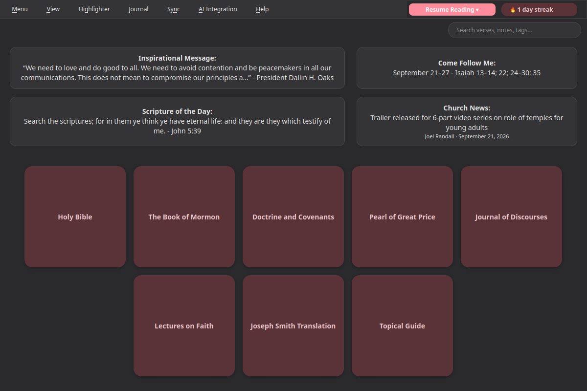
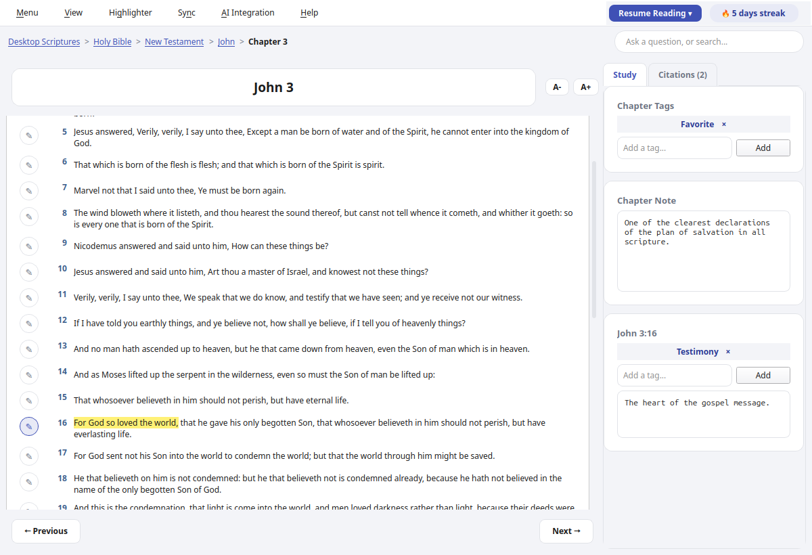
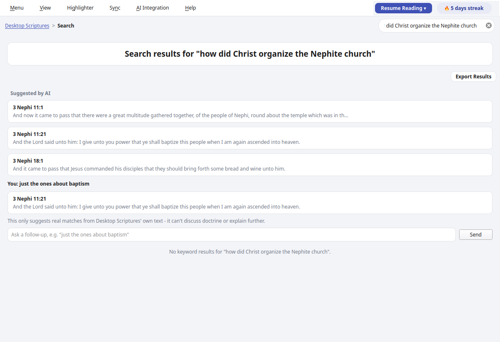
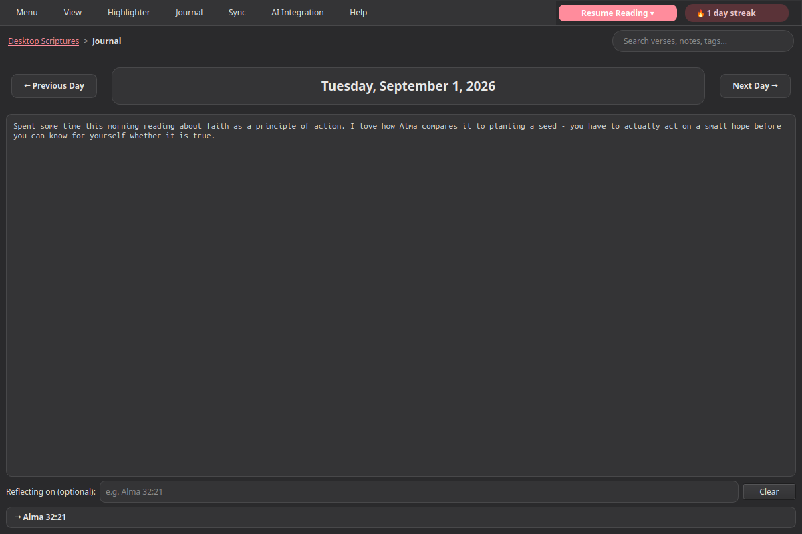

# Desktop Scriptures

[](https://snapcraft.io/desktop-scriptures)

A desktop reader for the Bible, Book of Mormon, Doctrine and Covenants,
Pearl of Great Price, Journal of Discourses, Lectures on Faith, and the
Joseph Smith Translation. The core reading and study experience works
fully offline - personal notes, tags, verse highlighting, keyword
search, a Topical Guide, General Conference citations, a Scripture of
the Day banner, a reading streak, a Resume Reading history of your last
5 chapters, a searchable Journal with one entry per day (optionally
linked to a verse or chapter you're reflecting on), a choice of accent
colors, and cloud-folder sync across your own devices (via whatever
cloud client - Nextcloud, OneDrive, Google Drive, or similar - already
keeps a folder synced on your machine, so the app itself never talks to
the network for this).

A handful of landing-page extras are opt-in and off by default, only
reaching the network once you turn them on: AI-assisted search (ask a
question in your own words - and refine it conversationally with
follow-ups - to get pointed at real, matching scripture, using your own
AI endpoint), a Church News headline, a Come Follow Me helper showing
this week's lesson, and an Inspirational Message featuring whatever's
currently on churchofjesuschrist.org's own homepage. A General
Conference reminder (also opt-in, also off by default) shows once a day
in the roughly two weeks before Conference starts, using the real
announced dates - dismissible for that Conference specifically, so it
comes back fresh for the next one. A Temple Recommend renewal reminder
works the same way, but entirely offline: enter your recommend's
expiration date once, and it shows once a day starting about two months
out (and every day past it, if it lapses) until you renew and update the
date.

This is an **unofficial** application, not produced by or affiliated
with The Church of Jesus Christ of Latter-day Saints, or with Community
of Christ. Scripture text courtesy of the [beandog/lds-scriptures](https://github.com/beandog/lds-scriptures)
project; Journal of Discourses and Joseph Smith Translation (published
as the "Inspired Version") text courtesy of their public-domain scans on
[archive.org](https://archive.org) (Journal of Discourses discourse
metadata cross-referenced from FAIR's index); General Conference
citation data courtesy of [BYU's Scripture Citation Index](https://scriptures.byu.edu).
The Topical Guide is Desktop Scriptures' own correlation of its local
scripture text and that same citation index (see
`scripts/build_topical_guide.py`) - not a copy of the Church's own,
separately-copyrighted Topical Guide.

## Screenshots









## Install

Desktop Scriptures is published on the Snap Store:

```
sudo snap install desktop-scriptures
```

## TODO

Features under consideration for future versions:

- [x] Reading history (v1.3 - Resume Reading now shows your last 5 chapters, most recent first)
- [x] AI-assisted search (v2.0 - ask a question in your own words in the search bar, then refine it conversationally with follow-ups, and get pointed at real, matching scripture; opt-in, bring-your-own AI endpoint - OpenAI, another compatible provider, or a locally-run server; see the AI Integration menu - v2.0.1 also surfaces any General Conference talks already known to cite a suggested verse)
- [ ] Talk prep helper (uses AI to suggest supporting scriptures, talks, etc.)
- [ ] Apocrypha?
- [x] Wiki
- [x] JST (v1.3)
- [x] Topical Guide (v2.0.1 - expanded from 25 to 46 topics)
- [x] Syncing capability (v2.0 - point at a folder already kept in sync by Nextcloud, OneDrive, Google Drive, Dropbox, or similar)
- [x] Theme enhancements (v2.0 - a choice of accent colors, loosely inspired by Ubuntu's Yaru accent picker)
- [ ] Listen to the scriptures - voice capability
- [x] CFM helper/reminder (v2.1.1 - an opt-in landing-page box showing this week's Come Follow Me lesson, off by default like Church News; the reminder half of this item is covered by the General Conference reminder below)
- [x] Church News button (v2.0.9 - an opt-in landing-page box showing the latest headline from Church News' own RSS feed, off by default like AI-assisted search)
- [ ] Linguistics references
- [ ] Archaeological references
- [ ] Family history reminder
- [x] Journal/Diary feature (v2.1.7 - a "Journal" menu with one free-text entry per day, page through past dates with Previous/Next, and an optional link to a specific verse or chapter you're reflecting on; syncs across devices and is included in Export Notes, like your other personal data; v2.1.8 makes entries keyword-searchable, matching what you actually wrote, not just what they're linked to)
- [x] General Conference reminder (v2.1.6 - an opt-in startup popup shown once a day in the ~2 weeks before Conference, using the real announced dates; off by default, with a per-Conference "don't remind me again" that resets for the next one)
- [ ] General Conference Talk auto updater
- [ ] Embedded webui for talk references, etc. 
- [x] Temple recommend renewal reminder (v2.1.9 - an opt-in, entirely offline reminder shown once a day starting ~2 months before the expiration date you enter, and every day past it until you renew and update the date; see View → "Temple Recommend Reminder...")
