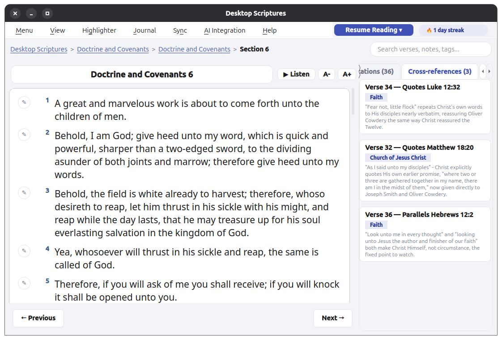

# Desktop Scriptures

[](https://snapcraft.io/desktop-scriptures)

A desktop reader for the Bible, Book of Mormon, Doctrine and Covenants,
Pearl of Great Price, Journal of Discourses, Lectures on Faith, and the
Joseph Smith Translation. The core reading and study experience works
fully offline - personal notes, tags, verse highlighting, keyword
search, a Topical Guide, General Conference and Ensign/Liahona citations,
a Cross-references tab pointing out known parallel passages elsewhere in
the corpus (an Isaiah chapter also quoted in the Book of Mormon, say)
alongside any you add yourself, a Scripture of the Day banner, a reading streak, a Resume Reading history of your last
5 chapters, a searchable Journal with one entry per day (optionally
linked to a verse or chapter you're reflecting on), a choice of accent
colors, cloud-folder sync across your own devices (via whatever cloud
client - Nextcloud, OneDrive, Google Drive, or similar - already keeps
a folder synced on your machine, so the app itself never talks to the
network for this), and Listen controls to have any chapter read aloud -
verse by verse, with the current verse highlighted as it goes - in a
choice of four bundled offline voices (American or British English,
male or female).

A handful of landing-page extras are opt-in and off by default, only
reaching the network once you turn them on: AI-assisted search (ask a
question in your own words - and refine it conversationally with
follow-ups - to get pointed at real, matching scripture, using your own
AI endpoint, plus an optional study index built through that same endpoint
so AI features can find passages by meaning), a Church News headline, a Come Follow Me helper showing
this week's lesson, and an Inspirational Message featuring whatever's
currently on churchofjesuschrist.org's own homepage. A General
Conference reminder (also opt-in, also off by default) shows once a day
in the roughly two weeks before Conference starts, using the real
announced dates - dismissible for that Conference specifically, so it
comes back fresh for the next one. A Temple Recommend renewal reminder
works the same way, but entirely offline: enter your recommend's
expiration date once, and it shows once a day starting about four weeks
out (and every day past it, if it lapses) until you renew and update the
date. A Family History reminder is opt-in too, but not on any fixed
schedule at all - once turned on, it nudges you at random intervals (at
least 4 days apart) so it stays noticeable instead of becoming background
noise, with a link straight to FamilySearch.

This is an **unofficial** application, not produced by or affiliated
with The Church of Jesus Christ of Latter-day Saints, or with Community
of Christ. Scripture text courtesy of the [beandog/lds-scriptures](https://github.com/beandog/lds-scriptures)
project; Journal of Discourses and Joseph Smith Translation (published
as the "Inspired Version") text courtesy of their public-domain scans on
[archive.org](https://archive.org) (Journal of Discourses discourse
metadata cross-referenced from FAIR's index); General Conference
citation data courtesy of [BYU's Scripture Citation Index](https://scriptures.byu.edu);
Ensign/Liahona citation data (English issues, 1971-present) detected directly
from each article's own scripture hyperlinks on
[churchofjesuschrist.org](https://www.churchofjesuschrist.org), since no
outside citation index for it exists. Both are metadata only - talk/
article title, speaker/author, date, and URL - never the underlying
talk or article text, which this app never stores or displays; it links
out to the original source instead.
The Topical Guide is Desktop Scriptures' own correlation of its local
scripture text and that same citation index (see
`scripts/build_topical_guide.py`) - not a copy of the Church's own,
separately-copyrighted Topical Guide. Cross-references are hand-curated
the same way (see `scripts/build_cross_references.py`) - an
accuracy-first list of 600 well-documented parallel passages (direct
quotations, paraphrases, Joseph Smith Translation/Moses-style revisions,
and typology scripture itself explicitly states, plus a smaller,
clearly-labeled "traditionally linked to" tier for widely-recognized
associations scripture doesn't explicitly state), each verified directly
against this app's own imported text rather than copied from any outside
source, and each tagged with the Topical Guide topic it's actually
teaching so it's clear what doctrine is at stake, not just which words
changed.
The Hebrew and Greek lexicons - what a Hebrew, Aramaic, or Greek word
means, searchable by its English meaning ("Messiah" finds *mashiach*,
"anointed"; "love" finds *agape*) and shown in the reading view's Word
Study tab - combine Strong's Hebrew and Greek dictionaries (public
domain) in [Open Scriptures](https://github.com/openscriptures/strongs)'
corrected editions, licensed CC BY-SA (that license applies to the
lexicon data, not to this app's MIT-licensed code), with short word
meanings from [STEP Bible](https://www.STEPBible.org) (Tyndale House,
Cambridge), licensed CC BY 4.0; see `scripts/import_lexicon.py`.
Book of Mormon names in the Word Study tab ("Shazer", "Zarahemla") are
labeled by how sure their meaning is - defined in the text itself, a
biblical name, a Hebrew root, a proposed meaning, or unknown - with each
scholarly proposal summarized in this project's own words and its
source, chiefly BYU's [Book of Mormon
Onomasticon](https://onoma.lib.byu.edu), linked rather than copied; see
`scripts/build_bom_names.py`.

## Screenshots




## Install

Desktop Scriptures is published on the Snap Store:

```
sudo snap install desktop-scriptures
```

## TODO

### v2.3 roadmap

- [ ] Talk prep helper - an AI-assisted chat for preparing a talk or lesson: suggests supporting scriptures, General Conference talks, and Ensign/Liahona articles for your subject, and helps narrow them down conversationally. Builds on the opt-in study index (AI Integration → Build Study Index...) and the source-ordered AI search results it already powers
- [ ] Apocrypha?

### v3.0 roadmap

The goal: ask about a word, a name, or a place and get a clear, sourced answer - what "Christ" or "Zarahemla" means, where a place was - even with a small AI model running on your own computer. Each item below is a new layer of the study index (see the Talk prep helper item above), so AI search finds it by meaning alongside the scriptures, and each is measured against the benchmark questions before it ships.

- [x] Hebrew and Greek word meanings - Strong's and STEP Bible, in the Word Study tab
- [x] Book of Mormon names (e.g. what "Zarahemla" means) - all 307, each labeled by confidence, with proposals summarized in our own words from BYU's Book of Mormon Onomasticon and linked, never copied
- [ ] Names highlighted in the text - click "Zarahemla" in a verse to open its Word Study card
- [ ] A word-by-word Strong's-tagged text, so Word Study shows the exact word behind a verse rather than every word the KJV translates that way
- [ ] Short, cited answers - a sentence or two drawn only from the sources found, every statement cited, rather than the AI only choosing among results as it does today; also the basis for the Talk prep helper
- [ ] Geography for all the Standard Works - Bible places and maps (e.g. OpenBible.info's openly licensed geocoding), and the Book of Mormon geography models (Heartland, Mesoamerican, Baja California, and others) shown side by side as their proponents' theories, since the Church takes no official position on Book of Mormon geography
- [ ] Archaeological references
- [ ] Optional content packs - these sources are large, so they'd download on demand (like the study index is built on demand) rather than ship inside the snap

Every source's license is checked before anything is imported - as with General Conference talks today, copyrighted works are linked and summarized, not copied.
