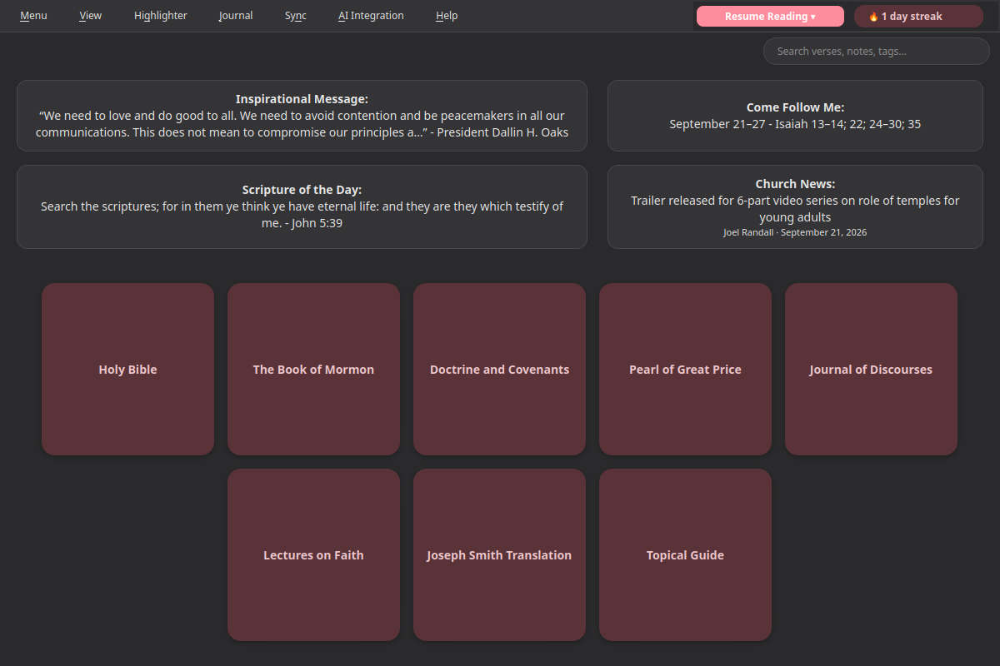
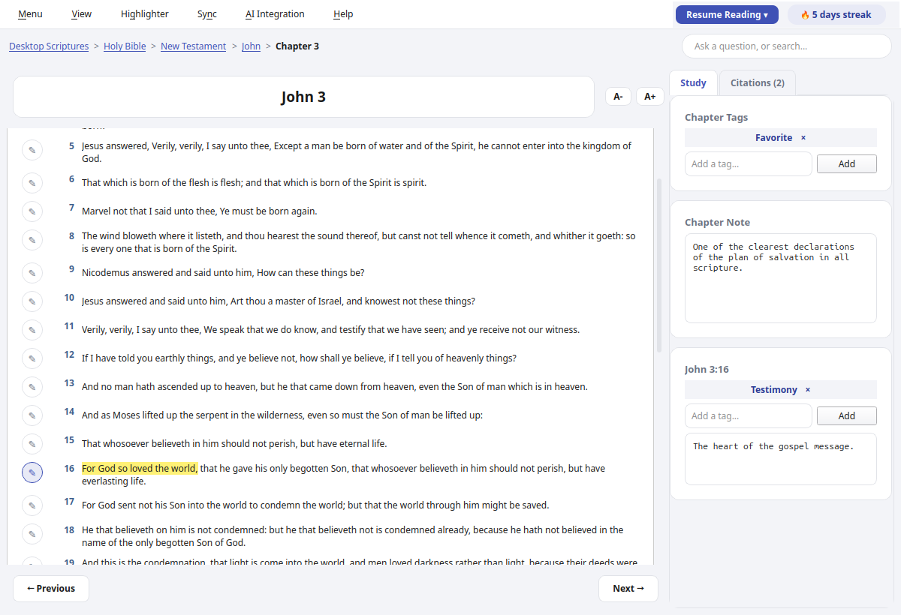
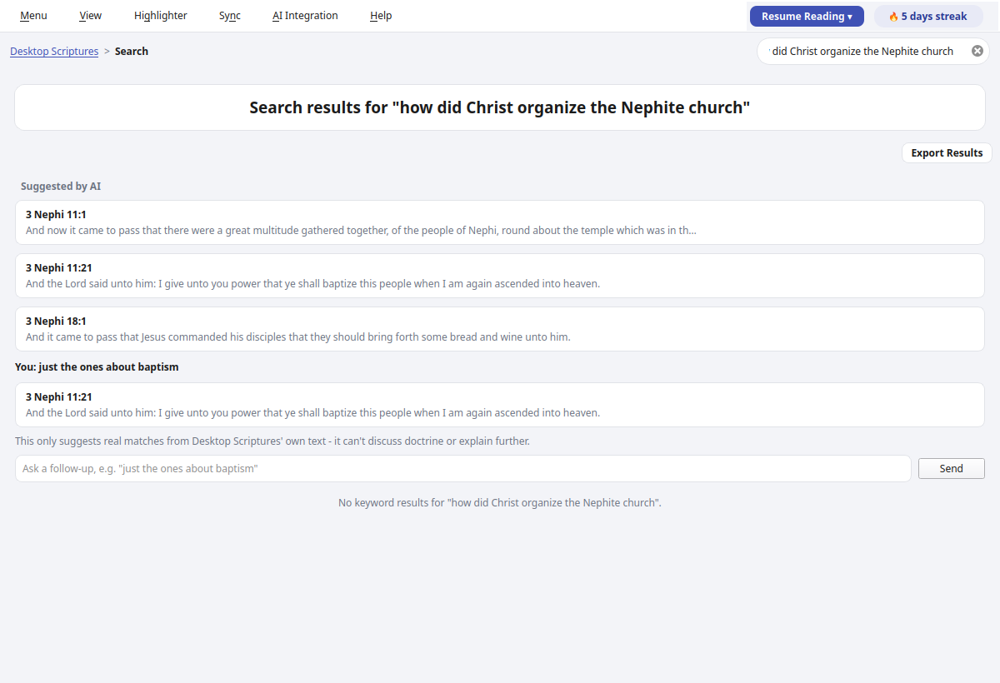
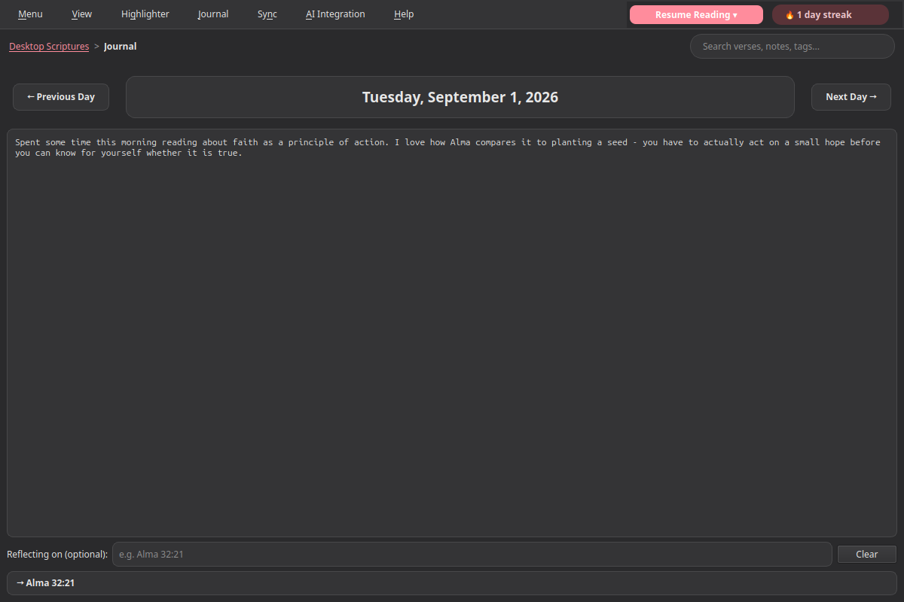
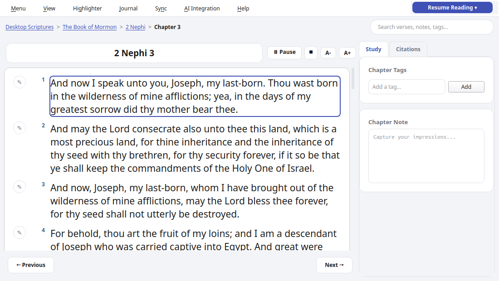

# Desktop Scriptures

[](https://snapcraft.io/desktop-scriptures)

A desktop reader for the Bible, Book of Mormon, Doctrine and Covenants,
Pearl of Great Price, Journal of Discourses, Lectures on Faith, and the
Joseph Smith Translation. The core reading and study experience works
fully offline - personal notes, tags, verse highlighting, keyword
search, a Topical Guide, General Conference and Ensign/Liahona citations,
a Cross-references tab pointing out known parallel passages elsewhere in
the corpus (an Isaiah chapter also quoted in the Book of Mormon, say),
a Scripture of the Day banner, a reading streak, a Resume Reading history of your last
5 chapters, a searchable Journal with one entry per day (optionally
linked to a verse or chapter you're reflecting on), a choice of accent
colors, cloud-folder sync across your own devices (via whatever cloud
client - Nextcloud, OneDrive, Google Drive, or similar - already keeps
a folder synced on your machine, so the app itself never talks to the
network for this), and Listen controls to have any chapter read aloud -
verse by verse, with the current verse highlighted as it goes - in a
choice of four bundled offline voices (American or British English,
male or female).

A handful of landing-page extras are opt-in and off by default, only
reaching the network once you turn them on: AI-assisted search (ask a
question in your own words - and refine it conversationally with
follow-ups - to get pointed at real, matching scripture, using your own
AI endpoint), a Church News headline, a Come Follow Me helper showing
this week's lesson, and an Inspirational Message featuring whatever's
currently on churchofjesuschrist.org's own homepage. A General
Conference reminder (also opt-in, also off by default) shows once a day
in the roughly two weeks before Conference starts, using the real
announced dates - dismissible for that Conference specifically, so it
comes back fresh for the next one. A Temple Recommend renewal reminder
works the same way, but entirely offline: enter your recommend's
expiration date once, and it shows once a day starting about four weeks
out (and every day past it, if it lapses) until you renew and update the
date. A Family History reminder is opt-in too, but not on any fixed
schedule at all - once turned on, it nudges you at random intervals (at
least 4 days apart) so it stays noticeable instead of becoming background
noise, with a link straight to FamilySearch.

This is an **unofficial** application, not produced by or affiliated
with The Church of Jesus Christ of Latter-day Saints, or with Community
of Christ. Scripture text courtesy of the [beandog/lds-scriptures](https://github.com/beandog/lds-scriptures)
project; Journal of Discourses and Joseph Smith Translation (published
as the "Inspired Version") text courtesy of their public-domain scans on
[archive.org](https://archive.org) (Journal of Discourses discourse
metadata cross-referenced from FAIR's index); General Conference
citation data courtesy of [BYU's Scripture Citation Index](https://scriptures.byu.edu);
Ensign/Liahona citation data (English issues, 1971-present) detected directly
from each article's own scripture hyperlinks on
[churchofjesuschrist.org](https://www.churchofjesuschrist.org), since no
outside citation index for it exists. Both are metadata only - talk/
article title, speaker/author, date, and URL - never the underlying
talk or article text, which this app never stores or displays; it links
out to the original source instead.
The Topical Guide is Desktop Scriptures' own correlation of its local
scripture text and that same citation index (see
`scripts/build_topical_guide.py`) - not a copy of the Church's own,
separately-copyrighted Topical Guide. Cross-references are hand-curated
the same way (see `scripts/build_cross_references.py`) - a short,
accuracy-first list of well-documented parallel passages (quotations,
paraphrases, and Joseph Smith Translation/Moses-style revisions), each
verified directly against this app's own imported text rather than
copied from any outside source, and each tagged with the Topical Guide
topic it's actually teaching so it's clear what doctrine is at stake, not
just which words changed.

## Screenshots











## Install

Desktop Scriptures is published on the Snap Store:

```
sudo snap install desktop-scriptures
```

## TODO

Features under consideration for future versions:

- [x] Reading history (v1.3 - Resume Reading now shows your last 5 chapters, most recent first)
- [x] AI-assisted search (v2.0 - ask a question in your own words in the search bar, then refine it conversationally with follow-ups, and get pointed at real, matching scripture; opt-in, bring-your-own AI endpoint - OpenAI, another compatible provider, or a locally-run server; see the AI Integration menu - v2.0.1 also surfaces any General Conference talks already known to cite a suggested verse)
- [ ] Talk prep helper (uses AI to suggest supporting scriptures, talks, etc.)
- [ ] Apocrypha?
- [x] Wiki
- [x] JST (v1.3)
- [x] Topical Guide (v2.0.1 - expanded from 25 to 46 topics; v2.2.2 - expanded further to 61 topics and put in alphabetical order)
- [x] Syncing capability (v2.0 - point at a folder already kept in sync by Nextcloud, OneDrive, Google Drive, Dropbox, or similar)
- [x] Theme enhancements (v2.0 - a choice of accent colors, loosely inspired by Ubuntu's Yaru accent picker)
- [x] Listen to the scriptures - voice capability (v2.2.1 - a "Listen" button in the reading view reads the current chapter aloud verse by verse, highlighting each as it goes, using a fully offline neural TTS engine (Piper); pick from 4 bundled voices - American or British English, male or female - under Menu → Voice)
- [x] CFM helper/reminder (v2.1.1 - an opt-in landing-page box showing this week's Come Follow Me lesson, off by default like Church News; the reminder half of this item is covered by the General Conference reminder below)
- [x] Church News button (v2.0.9 - an opt-in landing-page box showing the latest headline from Church News' own RSS feed, off by default like AI-assisted search)
- [ ] Linguistics references
- [ ] Archaeological references
- [x] Family history reminder (v2.2.0 - an opt-in nudge shown at random intervals of at least 4 days apart, rather than a fixed schedule, so it stays noticeable instead of getting tuned out; links straight to FamilySearch; see View → "Family History Reminder")
- [x] Journal/Diary feature (v2.1.7 - a "Journal" menu with one free-text entry per day, page through past dates with Previous/Next, and an optional link to a specific verse or chapter you're reflecting on; syncs across devices and is included in Export Notes, like your other personal data; v2.1.8 makes entries keyword-searchable, matching what you actually wrote, not just what they're linked to)
- [x] General Conference reminder (v2.1.6 - an opt-in startup popup shown once a day in the ~2 weeks before Conference, using the real announced dates; off by default, with a per-Conference "don't remind me again" that resets for the next one)
- [x] General Conference Talk auto updater (a monthly CI job re-runs the existing citation harvester and opens a PR if scriptures.byu.edu's index turned up anything new - see `.github/workflows/refresh-gc-citations.yml`; a dev/process change, not a new in-app feature, so it ships whenever its PRs are next merged rather than bumping the app version itself)
- [x] Ensign/Liahona citations (v2.2.3 - BYU's Citation Index has no corpus at all for the Ensign or Liahona, so this detects citations directly from each article's own scripture hyperlinks on churchofjesuschrist.org instead, covering every English issue from 1971 to present; see `scripts/harvest_liahona_citations.py`. Shows up alongside General Conference talks in the Citations tab and AI-assisted search's citing-works list, each clearly labeled by source - "Ensign" or "Liahona" depending on the issue's date, since the magazine was renamed for English readers in January 2021)
- [x] Temple recommend renewal reminder (v2.1.9 - an opt-in, entirely offline reminder shown once a day starting ~4 weeks before the expiration date you enter, and every day past it until you renew and update the date; see View → "Temple Recommend Reminder...")
- [x] Cross-references (v2.2.4 - a "Cross-references" tab alongside Study and Citations surfaces known parallel passages elsewhere in the corpus - quotations, paraphrases, and Joseph Smith Translation/Moses-style revisions - each clickable straight through to that other chapter; see `scripts/build_cross_references.py`. Deliberately a short, hand-curated, accuracy-first list rather than an attempt at exhaustive or automatic detection - every entry was checked directly against this app's own imported text before being added. Each entry is also tagged with the doctrine it's actually teaching - Atonement, Faith, Restoration, and so on - reusing the same Topical Guide topics rather than a separate taxonomy, as clickable chips through to that topic's own page, with the note explaining how both passages agree on that doctrine rather than just how the wording differs)
